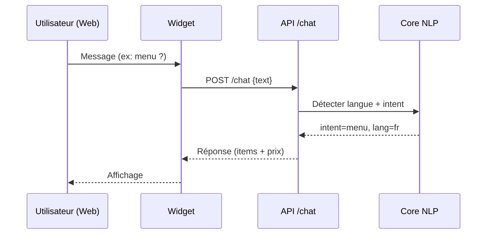
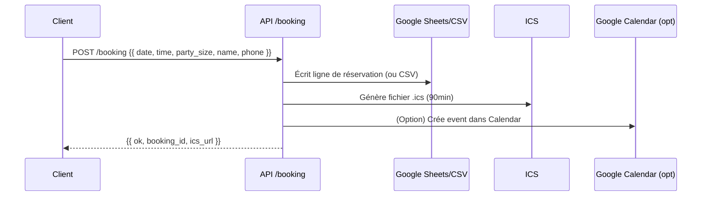
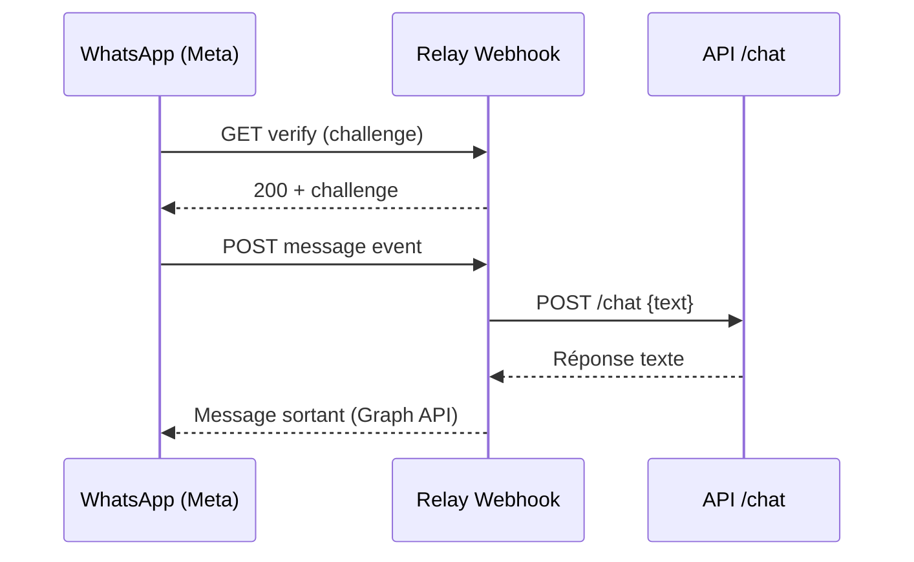

# Architecture — Iwacu MVP

> Vue d’ensemble des composants, flux, données et déploiement.

## 1) Diagramme global
```mermaid
flowchart LR
  subgraph Channels
    W(Web Widget)
    WA(WhatsApp Cloud API)
  end
  subgraph Relay
    R[Webhook Meta]
  end
  subgraph API[FastAPI]
    CHAT[/POST /chat/]
    MENU[/GET /menu/]
    PROMOS[/GET /promos/]
    HOURS[/GET /horaires, /horaires/today/]
    BOOK[/POST /booking/]
    ICS[/GET /booking/ics/{id}/]
  end
  subgraph Core
    NLP[(Regex FR/EN)]
    DATA[(CSV: menu, promos, hours, exceptions)]
    SHEETS[(Google Sheets)]
    ICSF[(ICS files)]
    GCAL[(Google Calendar optional)]
    LOGS[(conversations.jsonl)]
  end
  subgraph Dashboard
    D[Streamlit KPIs]
  end
  W --> CHAT
  WA --> R --> CHAT
  CHAT --> NLP --> DATA
  CHAT --> MENU
  CHAT --> PROMOS
  CHAT --> HOURS
  BOOK --> SHEETS & ICSF --> GCAL
  LOGS --> D
```

## 2) Séquences clés
### 2.1 Chat Web


### 2.2 Réservation


### 2.3 WhatsApp Cloud API (sandbox)


## 3) Données & schéma
- **CSV** : `menu.csv`, `promos.csv`, `hours.csv`, `hours_exceptions.csv`
- **Réservations** : Google Sheets (onglet `reservations`) ou `bookings.csv`
- **Logs** : `conversations.jsonl`
- **ICS** : 1 fichier par réservation (`/booking/ics/{id}`)

## 4) Déploiement
- **Local** : uvicorn (API), streamlit (dashboard), uvicorn (relay) + tunnel ngrok pour Meta
- **Cloud** : Railway/Fly.io, secrets protégés, domaine + HTTPS, services séparés

## 5) Sécurité
- ADC/OAuth pour Google (éviter secrets en clair)
- Tokens WhatsApp en secrets plateforme
- Validation Pydantic, CORS restreint, HTTPS en prod
